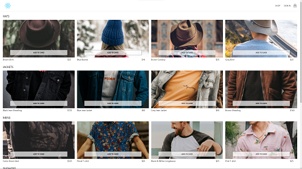
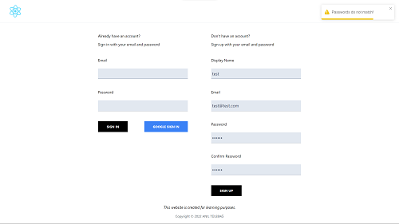
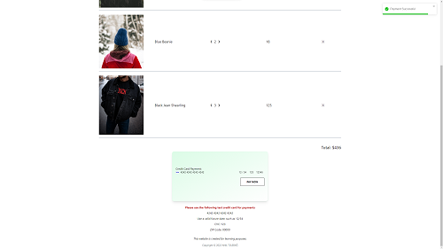

# Demo E-Commerce Clothing Store with React, Redux(incl. Redux-Saga), Firebase, Stripe and Tailwind CSS

A simple demo e-commerce store where users can add or remove products from shopping cart and buy products with their cards. Even if users leave the site, the products in their shopping cart will remain when they return.

## Tech Stack

<p align="left">


</p>

## Features

- Account creation with email or sign in with existing Google account
- Add or remove products from shopping cart
- Persist products inside of shopping cart even when refresh the page
- Payment with Stripe

## Demo

[Demo Link](https://bright-alpaca-35a3de.netlify.app/)

You can use test account information to try my demo

Email: test@test.com

Password: 12345678

## Screenshots







## Run Locally

Clone the project

```bash
  git clone https://github.com/aniltulebag/react-clothing-store.git
```

Go to the project directory

```bash
  cd react-clothing-store
```

Install dependencies

```bash
  npm install
```

Start the server

```bash
  npm run start
```

## Environment Variables

To run this project, you will need to add the following environment variables to your .env file

`REACT_APP_API_KEY`

`REACT_APP_AUTH_DOMAIN`

`REACT_APP_PROJECT_ID`

`REACT_APP_STORAGE_BUCKET`

`REACT_APP_MESSAGING_SENDER_ID`

`REACT_APP_APP_ID`

Setup a new [Firebase](https://console.firebase.google.com/) project and update environment variables with your new Firebase web app config information.

`REACT_APP_STRIPE_PUBLISHABLE_KEY`

`STRIPE_SECRET_KEY`

Sign up for a [Stripe account](https://dashboard.stripe.com) if you haven't already, login and navigate to the Developers > API Keys section. Grab your keys and define it in .env file

## Development

To test payment with Stripe

```bash
  npm run netlify-login
  # after then
  npm run netlify-dev
```

## Deployment

To deploy this project run

```bash
  npm run build
```

## License

[MIT](https://choosealicense.com/licenses/mit/)
